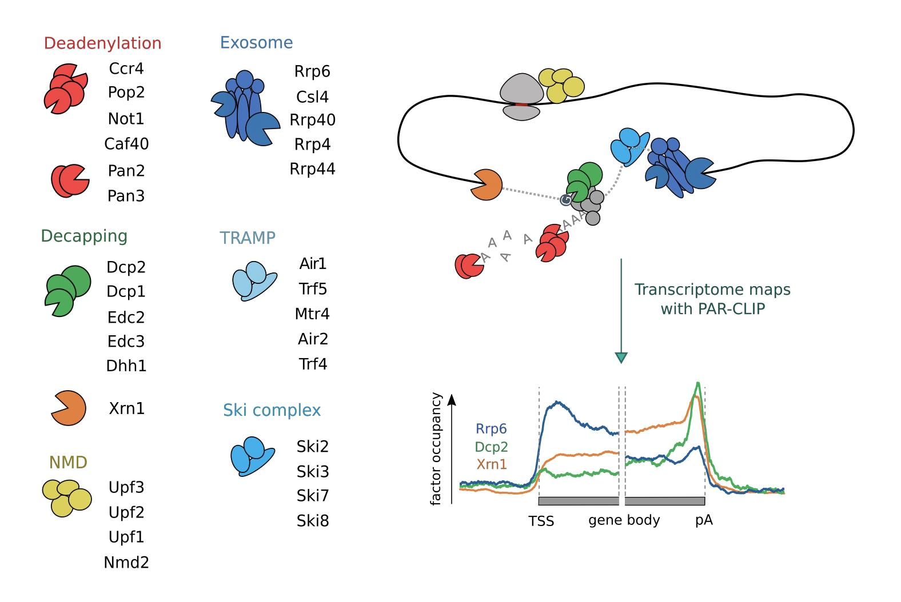

# Scripts for analysing PAR-CLIP data of RNA degradation factors in yeast
[Sohrabi-Jahromi, Salma, et al. "Transcriptome maps of general eukaryotic RNA degradation factors." eLife 8 (2019): e47040.](https://elifesciences.org/articles/47040)

### Summary:
RNA degradation pathways enable RNA processing, the regulation of RNA levels, and the surveillance of aberrant or poorly functional RNAs in cells. Here we provide transcriptome-wide RNA-binding profiles of 30 general RNA degradation factors in the yeast Saccharomyces cerevisiae. The profiles reveal the distribution of degradation factors between different RNA classes. They are consistent with the canonical degradation pathway for closed-loop forming mRNAs after deadenylation. Modeling based on mRNA half-lives suggests that most degradation factors bind intact mRNAs, whereas decapping factors are recruited only for mRNA degradation, consistent with decapping being a rate-limiting step. Decapping factors preferentially bind mRNAs with non-optimal codons, consistent with rapid degradation of inefficiently translated mRNAs. Global analysis suggests that the nuclear surveillance machinery, including the complexes Nrd1/Nab3 and TRAMP4, targets aberrant nuclear RNAs and processes snoRNAs.

### A guide on the scripts and notebooks based on the figures in our paper:

[Mockinbird](https://github.com/soedinglab/mockinbird) config files:

    preprocess.yaml
    postprocess.yaml

**Figure 1—figure supplement 1.** Biological replicate PAR-CLIP experiments have
high correlation.

    replicate_similarity.ipynb

**Figure 2.** Distribution of degradation factor cross-link sites over the yeast
transcriptome.

    enrichment_normalized.ipynb

**Figure 2—figure supplement 1.** Different transcript classes have comparable U-
content.

    U_content_check.ipynb

**Figure 2—figure supplement 2.** Metagene profiles for subunits of the TRAMP
complexes on snoRNA genes.

    metagene_density_graph.ipynb

**Figure 3.** Metagene analysis of degradation factor binding on mRNAs.

    heatmap_metageneplots.ipynb

**Figure 3—figure supplement 1.** Metagene profiles of yeast RNA degradation factors
centered on translation start and stop sites in comparison to TIF-annotated TSS
and pA sites.

    heatmap_metageneplots.ipynb
    
**Figure 4.** Surveillance of aberrant nuclear antisense RNAs by the exosome and the
TRAMP4 complex.

    heatmap_metageneplots.ipynb

**Figure 4—figure supplement 1.** Motif enrichment analysis shows enrichment of
Nrd1/Nab3 motifs for the TRAMP4 and the exosome complex.

    kmer_counting.ipynb
    
**Figure 5.** Global co-occupancy and co-localization analysis reveals unexpected
cooperation between factors from different complexes and pathways.

    co_occupancy.py
    co_localization.py
    co_occupancy.ipynb
    co_localization.ipynb

**Figure 5—figure supplement 1.** Co-occupancy for 74 RNA processing factors.

    co_occupancy.py
    co_occupancy.ipynb

**Figure 5—figure supplement 2.** Co-localization coefficients for all 74 RNA
processing factors.
**Figure 5—figure supplement 3.** Two-dimensional embedding of co-localization
between 74 RNA processing factors.

    co_localization.py
    co_localization.ipynb
    
**Figure 6.** Binding preferences reveal a link between decapping-mediated
degradation and translation.

    occupancy_by_features.ipynb
    codon_freq_bar.ipynb
    linear_regression.R

**Figure 6—figure supplement 1-9.**

    occupancy_by_features.ipynb

**Figure 7.** Location and recruitment of the decapping complex Dcp1/Dcp2 and
decapping enhancers Edc3, Dhh1, and Edc2.

    metagene_by_halflife.ipynb
    occupancy_by_features.ipynb
    kmer_counting.ipynb

